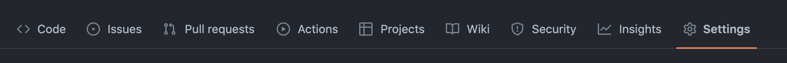
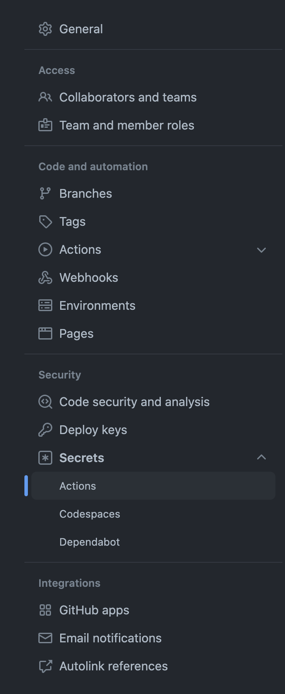
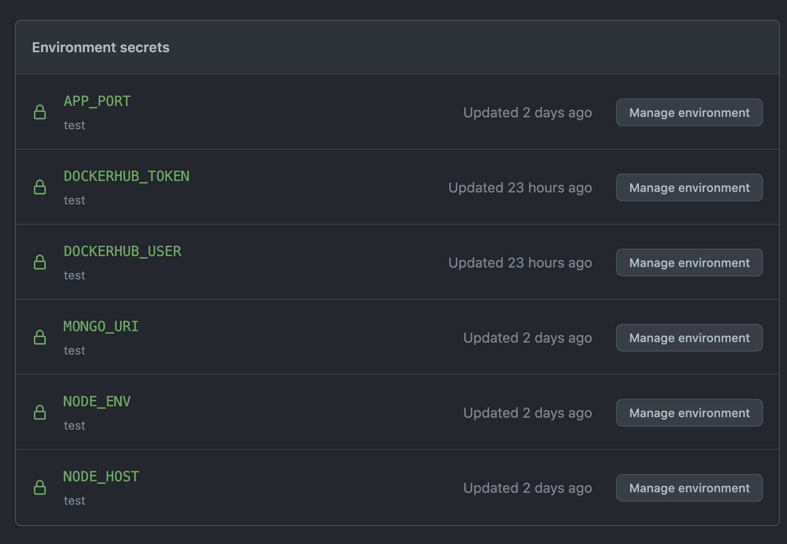
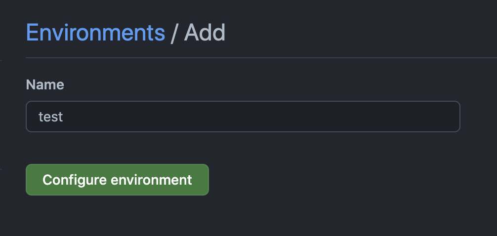
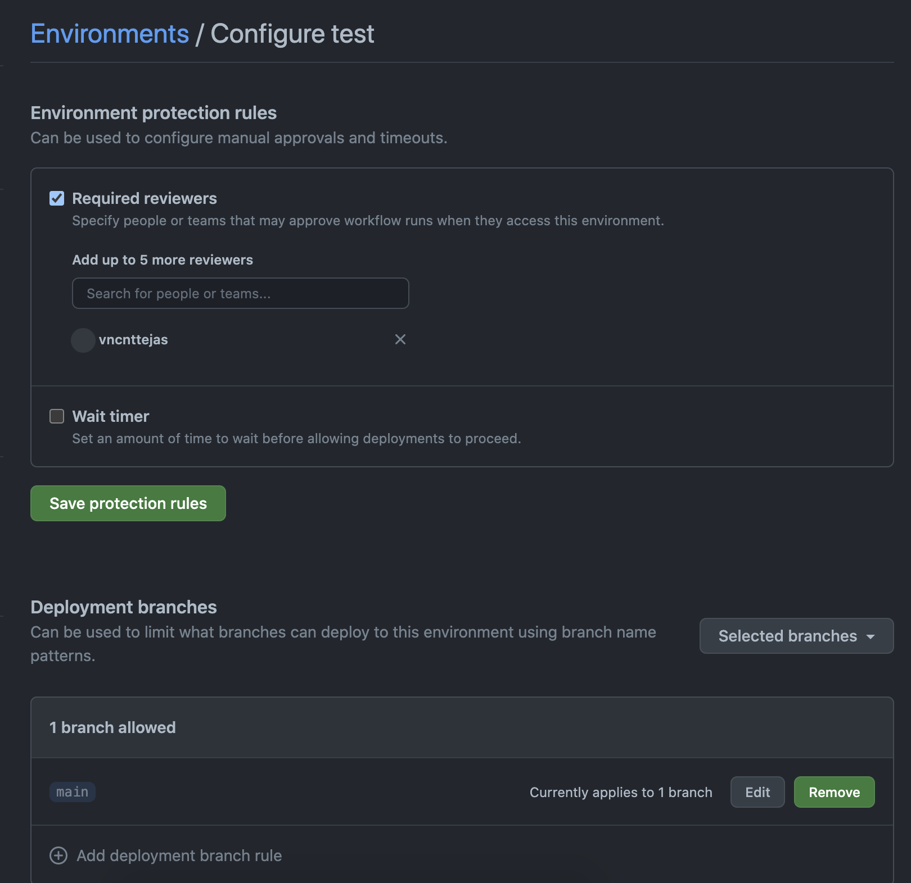

# Farm App Infra

The repo holds code to create Kubernetes cluster. It uses Github Actions to deploy the code to AWS infra provided the AWS access credentials

An that can be deployed to the repo can be found here - https://github.com/vncnttejas/farm-app

## One Time Tasks

### Create S3 bucket for state storage
- We need an S3 bucket for storing the terraform state
- The bucket can be created with the [create-s3-bucket-for-tf-state.sh](./scripts/create-s3-bucket-for-tf-state.sh) file
  ```bash
  aws s3api create-bucket \
    --bucket <bucket-name> \
    --region <aws-region>
  ```

### Github Setup
- Since the farm-app repo uses Github Actions for CI/CD, it is recommended to use of Github for this repo
- The github files can be found in the [.github](./github/workflows) folder, Github actions documentation page can help understand these files better.

#### Github Secrets Setup
- Since the CI/CD pipelines expect the secrets to be provided in the worflow files, we need to add these from the github settings page<br>
  <br>
  <br>
- Once on the page the required secrets can be added<br>
  <br>
- We also need to add an environment to handle handling environment specific secrets like database url
- To add an environment navigate to the environment link on the settings page
- Click on the "New Environment" button
- Add "test" environment on this page<br>
  <br>
- Add required reviewers if required, this helps to pause the deployment to the environment until an approval is provided<br>
  <br>
- Add environment specific values like
  - `KUBECONFIG` - Can be obtained from [helm-infra](.) deployment output
  - `APP_PORT`
  - `NODE_ENV`

